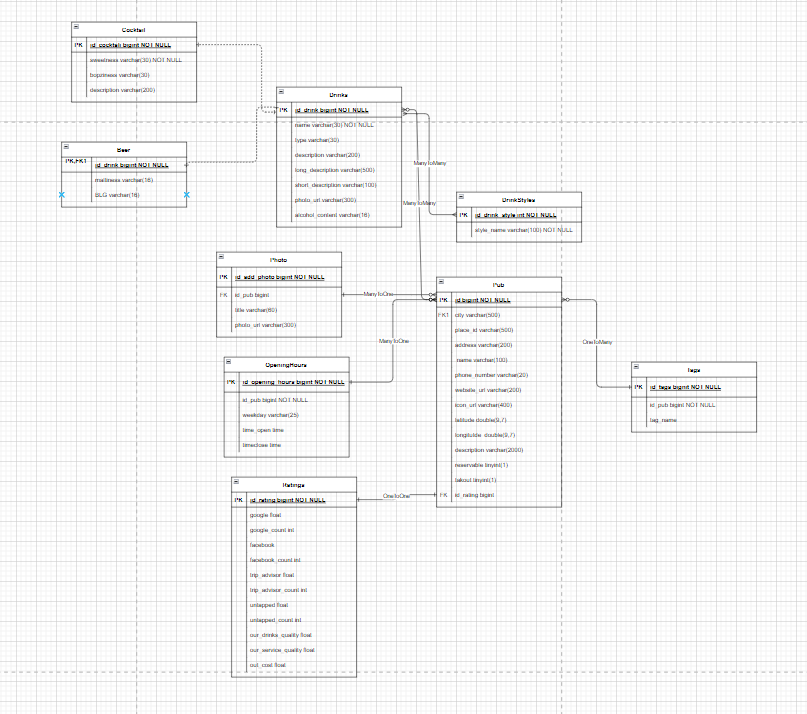

# Pubber REST API
A pubs management system with secure admin endpoints and public data access
## Summary
REST API for sharing and managing pub information including:
- Pub details
- Drinks & drink styles
- Opening hours
- Tags & photos
Built with Spring Boot in Java using JPA for database connection and OpenAPI for documentation.
## Development environment
### Toolchain:
- IntelliJ IDEA
- Gradle build system
- Docker (for local MySQL instance)
### Database configuration 
- Production - Mysql (configure via environment variables)
- Testing - H2 in-memory database
- Local Development (dev profile)- use included docker-compose.yml file to run MySQL server locally
## API  documentation
Documentation is automatically generated by OpenApi and is available at:
``
http://{YOUR_HOST}:{YOUR_PORT}/edit/swagger-ui/index.html
``
## Application architecture
### Security Model
- Public Endpoints (/pubs/**): Read-only access to pub information, Available without authentication
- Admin Endpoints (All other routes): Basic authentication required
### Used programming techniques
- DTO Separation 
  - clientdto - for public access
  - editdto - for admin in order to make easier access and modification of data
- Validation 
- Error Handling 
- Controller-service-repository pattern
- Integration tests
### Database diagram


## Configuration 
To run application in production profile, set up following environment variables:
```
DB_URL=jdbc:mysql://localhost:3306/Pubber
DB_USER=root
DB_PASSWORD=securepassword
APP_USERNAME=admin
APP_PASSWORD=secret
```